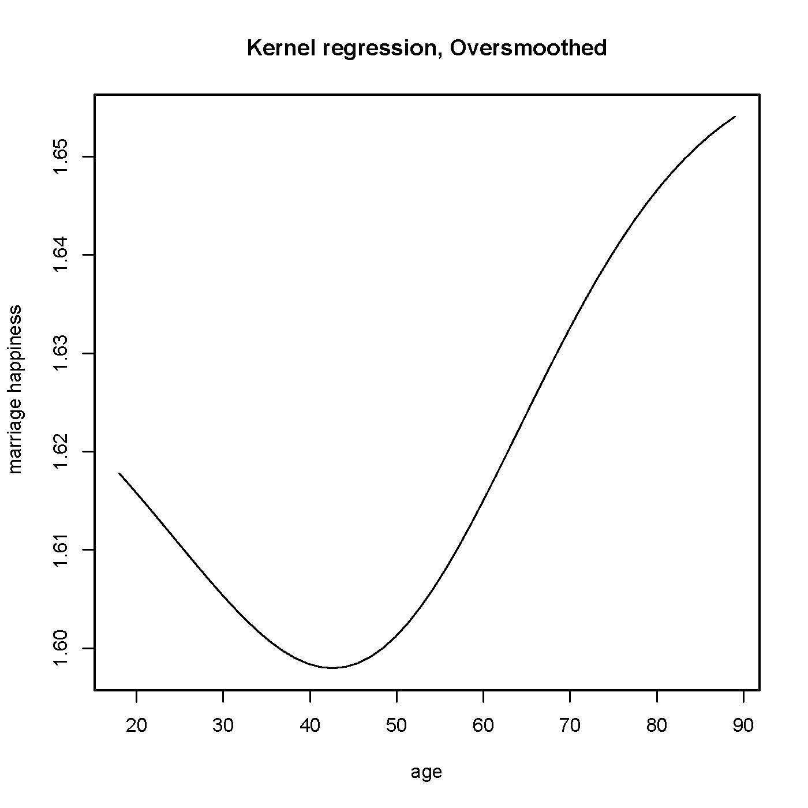
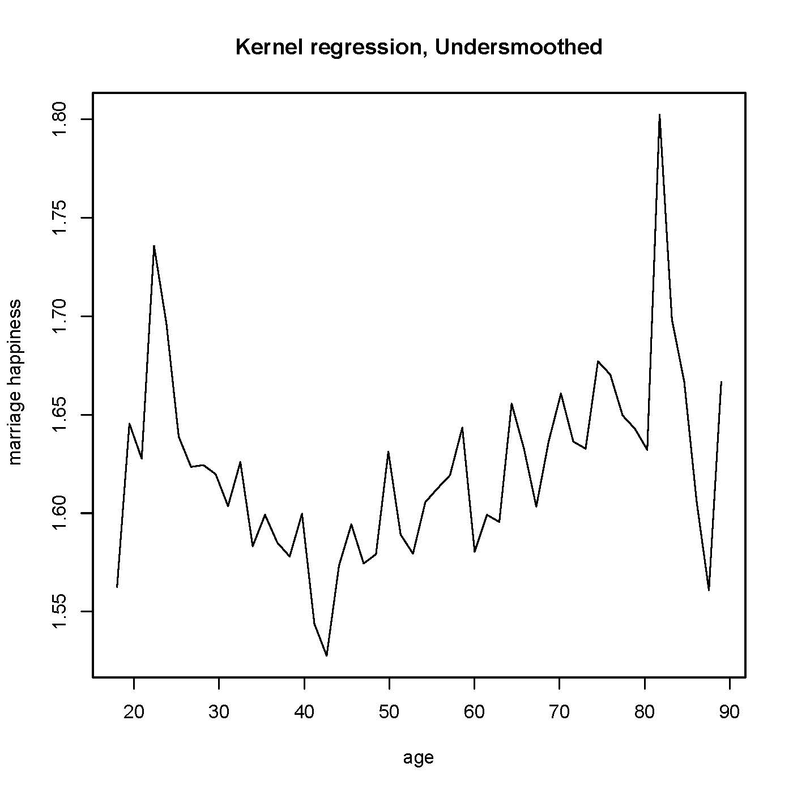
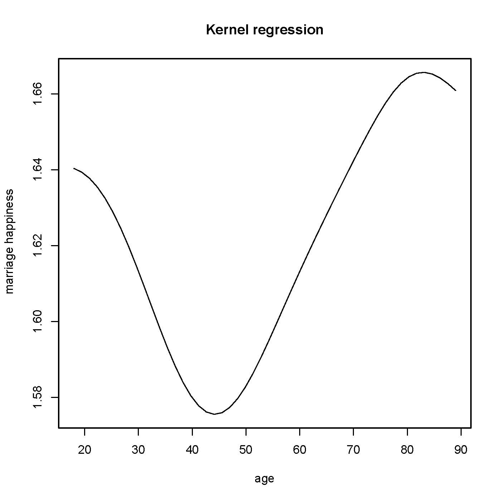

Welcome to your seventh homework assignment! You will have about one week to work through the
assignment. We encourage you to get an early start, particularly if you still feel you need more experience
using R. We have provided this PDF copy of the assignment so that you can print and work through
the assignment offline. You can also go online directly to complete the assignment. If you choose to
work on the assignment using this PDF, please go back to the online platform to submit your answers
based on the output produced. Some of the questions we are asking are not easily solvable using math
so we recommend you to use your R knowledge and the content of previous homeworks to find numeric
solutions.
Good luck :)!

**Question 1: Inference for a Randomized Experiment**
This problem is based on the following paper:
Duflo, Esther, Rema Hanna, and Stephen P. Ryan. 2012. “Incentives Work: Getting Teachers
to Come to School.” American Economic Review, 102(4): 1241-78.
In this experiment, the researchers set out to test whether providing teachers with cameras to take photos
to prove their attendance, could be effective in reducing teacher absenteeism. First, read the abstract
of the paper in the following link http://economics.mit.edu/files/5582. You can refer back to the
paper as necessary.

Note: The dataset used to generate the Lecture 15 slides relating to this paper is slightly different than the dataset we have provided, so do not be alarmed if your answers are slightly different! 

In order to complete this exercise we are providing you with the code 'problem1students_pset8.R' (downloaded from [here](https://prod-edxapp.edx-cdn.org/assets/courseware/v1/e0aa957d878ab207d486a817a3080e3d/asset-v1:MITx+14.310x+3T2018+type@asset+block/problem1students_pset8.R)). The code has some missing parts that you have to fill in order to run it.  The dataset that you will need is 'Data/teachers_final.csv' (downloaded from [here](https://prod-edxapp.edx-cdn.org/assets/courseware/v1/b4df7697b0d1e908e28498fef0c0298e/asset-v1:MITx+14.310x+3T2018+type@asset+block/teachers_final.csv))

```{r}
# Preliminaries
#-------------------------------------------------
#install.packages('perm')
library(tidyverse)
library(perm)
library(np)
rm(list = ls())
```

Let’s start by thinking through how Fisher’s ideas can be applied to evaluate this program in this
context.
1. First, suppose we only have 8 schools. Our aim is to calculate the Fisher’s exact p-value. Under the
assumption that we will have the same number of treated and control units, how many potential
treatment assignments across these 8 units are possible?
(a) 50
(b) 60
(c) 70
(d) 80
```{r}
"Potential treatment assignments across these 8 units"
choose(8, 4)
```

Suppose that after the treatment has been assigned and the experiment has been carried out, the researcher has the following data. The variable **open** corresponds to the fraction of days that the school was opened when random visits were made. 

Here is the data for 8 schools from the data in this study (found in teachers final.csv):
```{r}
school_data <- data_frame(treatment = c(0, 1, 0, 0, 0, 1, 1, 1), open = c(0.462, 0.731, 0.571, 0.923, 0.333, 0.750, 0.893, 0.692))
school_data
```

Assume that we define as our statistic the absolute difference in means by treatment status. To help you compute the test statistic for the observed data, we have provided you with the following R code (see in 'problem1students_pset8.R') to load in this table and generate different permutations, although it is missing some parts that you will need to fill in. We make use of the package perm, specifically the function ChooseMatrix, look it up and look up it’s arguments and read the code to make sure you understand what it is doing.
```{r}
perms <- chooseMatrix(8,4) # 70x8 matrix
"Possible assignments (some first rows): row -> 1 possible assignment, column -> school"
head(perms)

A <- matrix(c(0.462, 0.731, 0.571, 0.923, 0.333, 0.750, 0.893, 0.692), nrow=8, ncol=1, byrow=TRUE) # column vector with 8 rows
"Fraction of days that the school was opened when random visits were made (8 schools in total)"
A

treatment_avg <- (1/4)*perms%*%A
"Means of treatment groups (some first rows) across all possible assignments"
head(treatment_avg)

control_avg <- (1/4)*(1-perms)%*%A
"Means of control groups (some first rows) across all possible assignments"
head(control_avg)

test_statistic <- abs(treatment_avg-control_avg)
"Differences (in absolute) between means of treatment and control group (some first rows) across all possible assignments"
head(test_statistic)
```

**Question 2**
For this observed data, what would be the value of our statistic? (Please round your answer to two decimal places) We recommend you solve this problem algebraically and using R to check your answer.
```{r}
# Find row-number corresponding to true assignment
rownumber <- which(apply(perms, 1, function(x) all(x == c(0, 1, 0, 0, 0, 1, 1, 1))) == TRUE)
# Extract true difference between treatment and control groups
observed_test <- test_statistic[rownumber]
"Value of observed statistic"
observed_test
"Value of observed statistic (hand-calculated)"
abs(1/4 * (0.731 + 0.750 + 0.893 + 0.692) - 1/4 * (0.462 + 0.571 + 0.923 + 0.333))
```

Now, use your results to compute how many of these statistics are larger than the one from our observed data?
11
16
21
26
31
36
```{r}
larger_than_observed <- (test_statistic >= observed_test)
"Number of statistics exceeding value of observed statistic"
sum(larger_than_observed)

df <- data.frame(perms, control_avg, treatment_avg, test_statistic)
"Calculated data"
df
```

What would be the Fisher's Exact p-value in this case?
Please round your answer to two decimal places.
```{r}
"Fisher's Exact p-value"
sum(larger_than_observed) / nrow(perms)
```

**Question 4B**
Now load the data set teachers final.csv in R. If we want to test the sharp null hypothesis in this data, with 49 schools treated, is it the case that the number of possible assignments would be too large to do the problem (at least with your laptop and less than an hour of computing time)?
a. Yes
b. No
```{r}
"Data on schools"
schools <- read.csv("Data/teachers_final.csv") %>% print()
"Number of treated schools"
sum(schools$treatment == 1)
"Total number of schools"
length(schools$treatment)
```
The number of possible assignments would be too large (100 choose 49).

**Question 5**
A solution to this problem with a large number of observations is to simulate different random assignments and calculate the proportion of simulations in which the statistic exceeds the value of the observed data. We have provided you with the code that performs this exercise on the data teachers_final.csv with 100,000 simulations. If you run this code, is the approximate Fisher's p-value similar to the one we got with our 8 schools example?
a. Yes
b. No
```{r}
# Simulated assignments
num_assignments <- 100
set.seed(1001)
sim_treatments <- matrix(runif(100*num_assignments, min = 0, max = 1), nrow = num_assignments, byrow = TRUE)
for (i in 1:nrow(sim_treatments)) {
  sim_treatments[i,] <- as.numeric(rank(sim_treatments[i,]) <= 49)
} # for each row, turn 49 smallest values to 1's, other values to 0's

# Fraction of days that the school was opened when random visits were made (100 schools in total)
open_rates <- matrix(schools$open, nrow = 100, ncol = 1)

# Means of treatment groups across simulated assignments
treatment_means <- (1/49) * sim_treatments %*% open_rates

# Means of control groups across simulated assignments
control_means <- (1/(100-49)) * (1-sim_treatments) %*% open_rates

"Simulated statistics (partly shown)"
sim_stats <- abs(treatment_means - control_means)
sim_stats[1:10,]

"Actual statistic"
actual_stat <- abs((1/49) * sum(schools$treatment * schools$open) - (1/(100-49)) * sum((1-schools$treatment) * schools$open)) %>% print()

"Fraction of number of simulated statistics exceeding actual statistic (Fisher's p-value)"
sum(sim_stats >= actual_stat) / nrow(sim_stats)
```

**Question 6**
Since we are working in a very large sample, we can now consider Neyman's methods of inference. What is the Average Treatment Effect (ATE) on the observed data set?
Please round your answer to three decimal places.

```{r}
"Numbers of schools in treated and control groups"
counts <- table(schools$treatment)
Neyman <- data.frame(num_treated = counts["1"], num_control = counts["0"], num_total = sum(counts)) %>% print()

"Average Treatment Effect (ATE)"
Neyman$treatment_mean <- sum(schools$treatment * schools$open) / Neyman$num_treated
Neyman$control_mean <- sum((1-schools$treatment) * schools$open) / Neyman$num_control
Neyman$ATE <- Neyman$treatment_mean - Neyman$control_mean
Neyman$ATE
```

**Question 7**
What is the upper bound of the standard error of this point estimate using Neyman's method? (Hint: Use the conservative estimator of sampling standard deviation,, as your upper bound.)
Please round your answer to the three decimal places.
```{r}
"Neyman variance"
Neyman$estimated_treatment_variance <- (1/(Neyman$num_treated-1)) * sum(((schools$open-Neyman$treatment_mean) * schools$treatment) ^ 2)
Neyman$estimated_control_variance <- (1/(Neyman$num_control-1)) * sum(((schools$open-Neyman$control_mean) * (1-schools$treatment)) ^ 2)
Neyman$estimated_variance <-  (Neyman$estimated_treatment_variance/Neyman$num_treated) + (Neyman$estimated_control_variance/Neyman$num_control)
Neyman$estimated_variance

"Neyman upper bound of standard error (sqrt(variance))"
sqrt(Neyman$estimated_variance)
```

**Question 8**
What is the t-statistic if we want to test the null hypothesis the ATE is equal to zero?
PLease round your answer to the second decimal point, i.e. if your answer is 4.567, please round to 4.57, and if it is 4.562, please round to 4.56.
```{r}
"Neyman t-statistic under null (treatment effect = 0)"
Neyman$t_stat_null <- (Neyman$ATE-0) / sqrt(Neyman$estimated_variance)
Neyman$t_stat_null
```

**Question 9**
Is the associated p-value to this test similar to the one we found for the sharp null hypothesis in question 5?
a. Yes
b. No
```{r}
"Neyman p-value under null (treatment effect = 0)"
Neyman$t_prob_null <- 2 * pt(Neyman$t_stat_null, df = (Neyman$num_treated+Neyman$num_control)-1, lower.tail = FALSE)
Neyman$t_prob_null
```

**Question 10**
What is the 95% confidence interval of this test?
a. It is given by (0.127, 0.267)
b. It is given by (0.147, 0.247)
c. It is given by (0.157, 0.237)
d. It is given by (0.137, 0.257)
```{r}
"Neyman 95% confidence interval"
Neyman$lower_critical_value <- qt((1-0.95)/2, df = (Neyman$num_treated+Neyman$num_control)-1)
Neyman$upper_critical_value <- qt(0.95+(1-0.95)/2, df = (Neyman$num_treated+Neyman$num_control)-1)
Neyman$lower_bound <- Neyman$ATE - Neyman$upper_critical_value*sqrt(Neyman$estimated_variance)
Neyman$upper_bound <- Neyman$ATE - Neyman$lower_critical_value*sqrt(Neyman$estimated_variance)
cat("(", Neyman$lower_bound, ", ", Neyman$upper_bound, ")\n")

Neyman
```

Now, imagine that you are considering a similar randomized experiment as the Duflo/Hanna/Ryan camera experiment, except you plan to give teachers lower incentives - half the monetary amount as in the Duflo/Hanna/Ryan experiment.

**Question 11**
If you think that the relationship between incentives and the variable open is linear, what would be the expected ATE of this new intervention?
Please round your answer to the third decimal place, i.e. if it is 0.3414, please round to 0.341.
```{r}
"Average Treatment Effect when incentives cut down by half (linear relationship assumed)"
1/2 * Neyman$ATE
```

**Question 12**
Assume that this value is the minimum ATE such that the intervention is cost-effective. What is the sample size required to have a power of at least 90%, with the following properties?
* with a significance level of 5%
* an equal number of treated and control units
* variance is the average of the variance of the control and the treatment group in the existing data
a. 100
b. 110
c. 120
d. 130
```{r}
"Neyman parameters (assuming Average Treatment Effect reduced by half)"
Neyman_reduced <- data.frame(significance = 0.05, power = 0.9, frac_treated = 0.5)
Neyman_reduced$assumed_variance <- 1/(Neyman$num_treated+Neyman$num_control) * (Neyman$num_treated*Neyman$estimated_treatment_variance + Neyman$num_control*Neyman$estimated_control_variance)
Neyman_reduced$assumed_effect <- 1/2 * Neyman$ATE
Neyman_reduced

"Neyman sample size"
Neyman_reduced$num_total <- 1/(Neyman_reduced$assumed_effect^2/Neyman_reduced$assumed_variance * Neyman_reduced$frac_treated * (1-Neyman_reduced$frac_treated)) * ((qnorm(Neyman_reduced$power) + qnorm(1-1/2*Neyman_reduced$significance)))^2
Neyman_reduced$num_total
```

Now we are going to consider non parametric regressions. The following plots show three different non-parametric regressions that relates the level of happiness in a marriage with age (where 2 corresponds to "very happy", 1 to "pretty happy", and 0 to "not too happy").
Plot A:

Plot B:

Plot C:


**Question 13**
Rank the three plots from the one with the narrower to the wider bandwidth.
a, b, c
a, c, b
b, a, c
b, c, a
c, a, b
c, b, a
```{r}
"Narrower to wider bandwidth"
"b, c, a"
```

Going back to the data from teachers incentives.csv, we are now going to focus on two variables: pctpostwritten , which denotes the mean student test scores after the intervention and open. We want to see what the relationship between the fraction of days the school is open and student achievment. To this end, use the kernel regression code from lecture, to plot the kernel regression between these two variables using the R package np which Prof.Duflo illustrated in lecture.

**Question 14**
Use your code to generate plots for the following bandwidths, which of them seems most appropriate given the data? (select one)
a. 0.04
b. 0.001
c. 1
d. 20
```{r}
attach(schools)

"Bandwidth 0.04 model"
bw_0p04 <- npreg(xdat = pctpostwritten, ydat = open, bws = 0.04, bandwidth.compute = FALSE)
plot(bw_0p04)

"Bandwidth 0.001 model"
bw_0p001 <- npreg(xdat = pctpostwritten, ydat = open, bws = 0.001, bandwidth.compute = FALSE)
plot(bw_0p001)

"Bandwidth 1 model"
bw_1 <- npreg(xdat = pctpostwritten, ydat = open, bws = 1, bandwidth.compute = FALSE)
plot(bw_1)

"Bandwidth 20 model"
bw_20 <- npreg(xdat = pctpostwritten, ydat = open, bws = 20, bandwidth.compute = FALSE)
plot(bw_20)

detach(schools)
```

**Question 17**
Generate a plot of the CDFs for each cohort to see those results visually.Does the distribution of scores in the treatment group FOSD that of the control group?
a. Yes
b. No
```{r}
# Create data frame (scores and group names) for ggplot()
scores <- select(schools, treatment, pctpostwritten)
colnames(scores)[colnames(scores) == "treatment"] <- "group_name" # change column name from 'treatment' to 'group_name'
scores$group_name <- recode(scores$group_name, '1' = "treatment", '0' = "control") # replace '1' with 'treatment', '0' with 'control' in 'group_name' column
scores_by_groupname

# Compute CDFs for treatment and control groups
scores <- ddply(scores, .(group_name), transform, CDF = ecdf(pctpostwritten))
scores

# Plot CDFs for treatment and control groups
ggplot(scores, aes(x = pctpostwritten, colour = group_name)) + stat_ecdf() + labs(title = "CDFs of mean student test score for treatment and control groups", x = "mean score", y = "probability")
```


